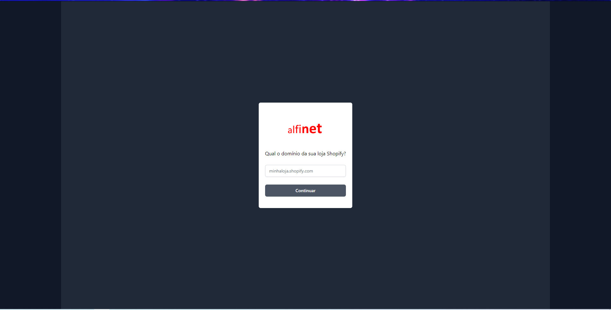

# Alfinet - Alexa Account link server

Esse servidor só é necessário pois, no momento de início da vinculação de conta da Alexa, não temos o domínio da Loja Shopify do cliente para começar o processo de instalação/login.

### Pré requisitos pro servidor
Configurar as variáveis de ambiente no servidor (em ambiente de dev, só renomear o `.env.sample` para `.env` e colocar os valores nele)
```
SHOPIFY_API_KEY='APP_API_KEY123'
SHOPIFY_API_SECRET_KEY='APP_SECRET_KEY'
```

#### Fluxo:

1. Cliente solicita vinculação de conta no aplicativo da Alexa
2. (*Aqui que esse projeto entra*) cliente informa o domínio da sua loja Shopify

3. Daqui em diante segue o fluxo OAuth padrão do Shopify e desse app para conseguir um access_token
4. Obtido o token, ele é retornado para a skill Alexa e de lá a ideia é que ele poderá ser usado para fazer chamadas direto na API do Shopify
